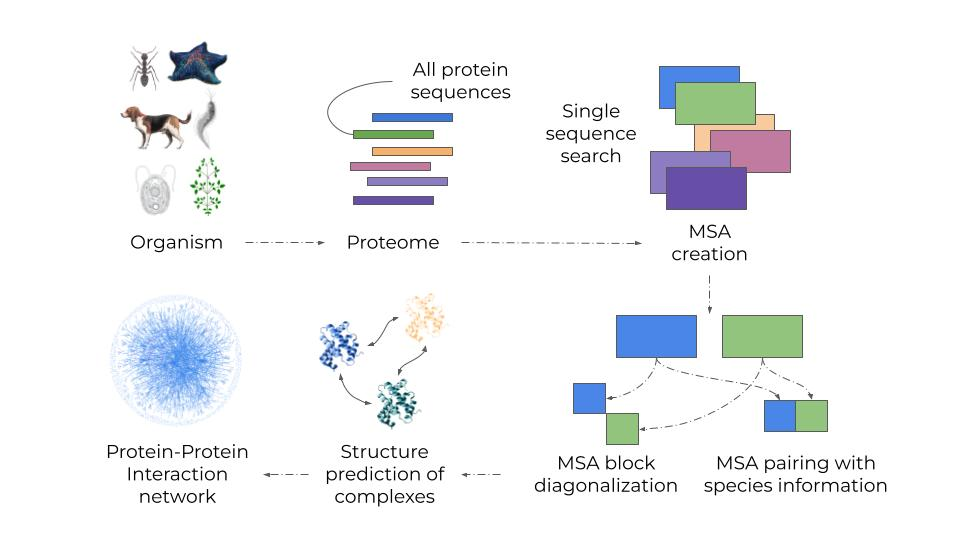

# SpeedPPI

This repository contains code for predicting a pairwise protein-protein interaction network from a set of protein sequences or two lists of sequences thought to interact.
\

\
The procedure is based on MSA creation and evaluation with AlphaFold2 adapted for pairwise interactions aka [FoldDock](https://www.nature.com/articles/s41467-022-28865-w)
\
\
AlphaFold2 is available under the [Apache License, Version 2.0](http://www.apache.org/licenses/LICENSE-2.0) and so is SpeedPPI, which is a derivative thereof.  \
The AlphaFold2 parameters are made available under the terms of the [CC BY 4.0 license](https://creativecommons.org/licenses/by/4.0/legalcode) and have not been modified.
\
**You may not use these files except in compliance with the licenses.**
\
For an example study, see [Towards a structurally resolved human protein interaction network](https://www.nature.com/articles/s41594-022-00910-8) where 65,484 human protein interactions were evaluated.
\
\
*The number of possible pairs grows quadratically with the number of input sequences.* \
As this number rapidly becomes too large to handle, we apply a number of techniques to speed up the
network generation. We also greatly reduce the memory footprint of the dependencies for the protein structure prediction and generated MSAs. Overall, the **speedup is 42 times** (for a set of 1000 proteins, 499500 pairwise interactions) and the **disk space reduction 4460 times**.
\
We provide *two options* for running **SpeedPPI**:
1. *All-vs-all* mode.
- Runs all proteins in a fasta file against each other.
2. *Some-vs-some* mode.
- Runs all proteins in two different fasta files against each other.

The PPI network is built automatically and all structures above a score threshold that you set are
saved to disk.
\
Follow the instructions below, provide your sequences and relax while your network is being built.
\
If you like SpeedPPI, please star this repo and if you use it in your research please cite [FoldDock](https://www.nature.com/articles/s41467-022-28865-w) and [SpeedPPI](link)


# Install dependencies

*Python packages*

There are two options to install the packages used here.

1. Install all packages to your local environment with python pip.
This is recommended - if possible.
```
bash install_pip_requirements.txt
```
2. Install all packages into a conda environment (requires https://docs.conda.io/en/latest/miniconda.html)
```
conda env create -f speed_ppi.yml
```

Note that the prediction part here runs on GPU. You will therefore have to install all appropriate CUDA drivers for your system. Otherwise the GPU will not be used. \
The installation scripts do install these drivers, but this can fail in some cases. \
To check if the gpu is accessed (first activate the conda environment if this was installed: conda activate SpeedPPI), run:
```
python3 ./src/test_gpu_avail.py
```
If the output is "gpu" - everything is fine.

*HHblits*
\
This is installed from source.
```
git clone https://github.com/soedinglab/hh-suite.git
mkdir -p hh-suite/build && cd hh-suite/build
cmake -DCMAKE_INSTALL_PREFIX=. ..
make -j 4 && make install
cd ..
```

*Uniclust30*
\
25 Gb download, 87 Gb extracted
```
wget http://wwwuser.gwdg.de/~compbiol/uniclust/2018_08/uniclust30_2018_08_hhsuite.tar.gz --no-check-certificate
mkdir data/uniclust30
mv uniclust30_2018_08_hhsuite.tar.gz data/uniclust30
tar -zxvf data/uniclust30/uniclust30_2018_08_hhsuite.tar.gz -C data/uniclust30/
```

*AlphaFold2 parameters*
```
mkdir data/params
wget https://storage.googleapis.com/alphafold/alphafold_params_2021-07-14.tar
mv alphafold_params_2021-07-14.tar data/params
tar -xf data/params/alphafold_params_2021-07-14.tar
mv params_model_1.npz data/params
```

*Cleanup - remove unnecessary files*
```
rm data/uniclust30/uniclust30_2018_08_hhsuite.tar.gz
rm data/params/alphafold_params_2021-07-14.tar
rm params_*.npz
```

# Run the pipeline

- All-vs-all mode. Input paths to the following resources (separated by space)
1. A fasta file with sequences for all proteins you want to analyse
2. Path to HHblits (default: hh-suite/build/bin/hhblits)
3. Output directory
4. pDockQ threshold. This determines what structures are saved to disk. (0.5 is recommended)
\
\
Try the test case:
```
bash create_ppi_all_vs_all.sh ./data/dev/test.fasta hh-suite/build/bin/hhblits ./data/dev/all_vs_all/ 0.5
```

- Some-vs-some mode
1. A fasta file with sequences for the proteins in list 1
1. A fasta file with sequences for the proteins in list 2
2. Path to HHblits
3. Output directory
4. pDockQ threshold. This determines what structures are saved to disk. (0.5 is recommended)

\
\
Try the test case:
```
bash create_ppi_some_vs_some.sh ./data/dev/test1.fasta ./data/dev/test2.fasta hh-suite/build/bin/hhblits ./data/dev/some_vs_some/ 0.5
```

# Note
If you have a computational cluster available, it will be much faster to run your predictions in parallel. This requires some knowledge of computational infrastructure, however. Steps 2-4 in create_ppi_[all_vs_all, some_vs_some].sh are written in individual scripts assuming a SLURM infrastructure in ./src/parallel/. You can copy these, modify the paths and variables and queue them at your cluster to make the predictions even more efficient!
