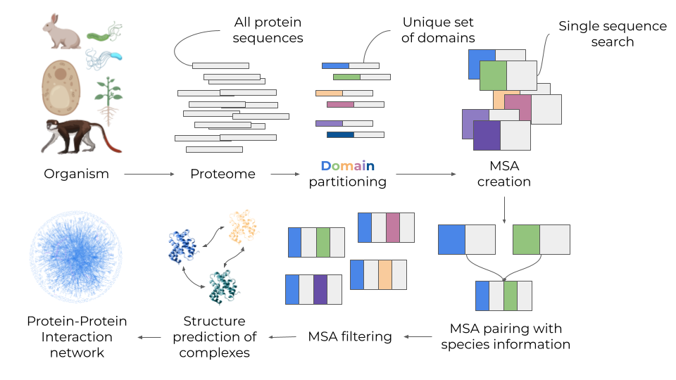

# SpeedPPI

This repository contains code for predicting the pairwise interaction network from a set of protein sequences.
\

\
The procedure is based on MSA creation and evaluation with AlphaFold2 adapted for pairwise interactions aka [FoldDock](https://www.nature.com/articles/s41467-022-28865-w) \
\
For an example study, see [Towards a structurally resolved human protein interaction network](https://www.nature.com/articles/s41594-022-00910-8) where 65,484 human protein interactions were evaluated.
\
The number of possible pairs grows exponentially with the number of input sequences according to: \
n*(n-1)/2, where n is the number of input sequences.
\
\
As this number rapidly becomes too large to handle, we apply a number of techniques to speed up the
network generation. We also greatly reduce the memory footprint of the dependencies for the protein structure prediction and generated MSAs. Overall, the speedup is XXX times (for a set of 1000 proteins) and the memory reduction >97%.
\
We provide two options for running **SpeedPPI**:
1. All-vs-all mode.
- Runs all proteins in a fasta file against each other.
2. Some-vs-some mode.
- Runs all proteins in two different lists against each other


# Install dependencies

*Python packages*
\
There are two options to install the packages used here:
1. Install all packages to your local environment with python pip
2. Install all packages into a conda environment (requires https://docs.conda.io/en/latest/miniconda.html)
\
Note that the prediction part here runs on GPU. You will therefore have to install all appropriate
CUDA drivers for your system. Otherwise the GPU will not be used.

*HHblits*
\
This is installed from source.
```
git clone https://github.com/soedinglab/hh-suite.git
mkdir -p hh-suite/build && cd hh-suite/build
cmake -DCMAKE_INSTALL_PREFIX=. ..
make -j 4 && make install
cd ..
```

*Uniclust30*
\
25 Gb download, 87 Gb extracted
```
wget http://wwwuser.gwdg.de/~compbiol/uniclust/2018_08/uniclust30_2018_08_hhsuite.tar.gz --no-check-certificate
mkdir data/uniclust30
mv uniclust30_2018_08_hhsuite.tar.gz data/uniclust30
tar -zxvf data/uniclust30/uniclust30_2018_08_hhsuite.tar.gz -C data/uniclust30/
```

# Run the pipeline

- All-vs-all mode
1. A fasta file with sequences for all proteins you want to analyse
2. Path to HHblits
3. Output directory
\
\
Try the test case:
```
bash create_ppi.sh ./data/dev/test.fasta HHblits ./data/dev/
```

- Some-vs-some mode

\
\
Try the test case:

# Note
If you have a computational cluster available, it will be much faster to run your predictions in parallel. This requires some knowledge of computational infrastructure, however. Steps 2-4 in create_ppi.sh are written in individual scripts assuming a SLURM infrastructure. You can copy these, modify the paths and variables and queue them at your cluster to make the predictions even more efficient!
